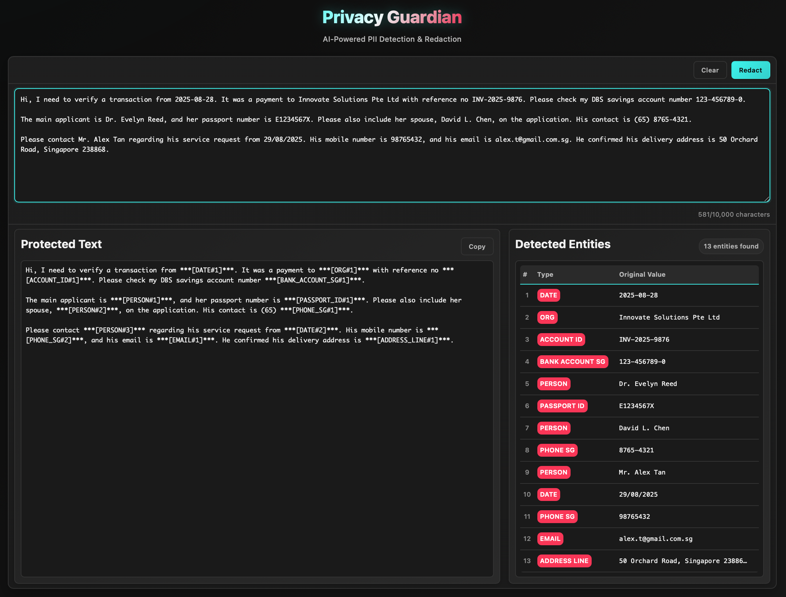

# Privacy Guardian 


**AI-Powered PII Detection & Redaction for Safer AI Interactions**

[](https://python.org)
[](https://fastapi.tiangolo.com)
[](https://huggingface.co/transformers)
[](https://spacy.io)
[](LICENSE)

> **TechJam 2025 - Problem Statement 7: Privacy Meets AI**
> 
> This project directly addresses the critical need to protect user privacy by detecting and redacting sensitive information from text before it is processed by cloud-based AI services.

##  Problem Statement Alignment

In an era dominated by powerful cloud-based Generative AI, the risk of inadvertently exposing Personally Identifiable Information (PII) is a significant concern. **Privacy Guardian** provides a robust, on-premise solution that acts as a protective shield, ensuring that sensitive data never leaves the user's control. It meticulously inspects and redacts text in real-time, allowing for safe and secure interactions with any AI service.

This project embodies the "Privacy of AI" challenge by enhancing the privacy of the AI ecosystem itself, creating a necessary layer of trust and security between users and the cloud.


## Key Features

Our enhanced redaction engine provides state-of-the-art PII detection through a sophisticated, multi-layered approach.

* **Multi-Layer Detection Engine**: Combines multiple techniques for maximum recall and precision.
    * **High-Specificity Regex**: A curated and extensible library of regular expressions (`canonical_regex.json`) to catch structured PII like IDs, phone numbers, and emails with surgical accuracy.
    * **Context-Aware Capture**: A novel approach (`context_capture.json`) that first identifies keywords (e.g., "my nric is") and then applies a targeted regex in a small subsequent window, dramatically reducing false positives.
    * **AI-Powered NER**: Utilizes a spaCy model (e.g., `en_core_web_sm`) for general-purpose Named Entity Recognition to identify entities like `PERSON`, `LOCATION`, and `ORG`.

* **Advanced Adjudication Logic**: A smart resolution engine that intelligently handles overlapping detections from different layers.
    * **Specificity-Based Prioritization**: Automatically selects the most specific detection in an overlap (e.g., `NRIC_SG` from regex is preferred over a generic `PERSON` from NER).
    * **Intelligent Entity Merging**: Merges adjacent `PERSON` entities (e.g., "John von Neumann") even when separated by connectors, creating more natural and accurate redactions.

* **Fully Configurable & Extensible**:
    * **Externalized Rules**: Detection logic is not hard-coded. Easily add or modify regex patterns, context rules, and label synonyms via simple JSON files.
    * **Label Normalization**: A synonym map (`label_synonyms.json`) ensures consistency by mapping different NER model outputs (e.g., `PER`, `NAME`) to a canonical `PERSON` label.

* **High-Performance Asynchronous API**:
    * Built with **FastAPI** to handle concurrent requests efficiently.
    * CPU-bound NLP tasks are run in a separate thread pool to prevent blocking the event loop, ensuring the API remains responsive under load.

* **Privacy-First Architecture**:
    * **100% On-Premise**: The entire application, including models and logic, runs in your environment. No data is ever sent to third-party services.


##  Technical Architecture

Privacy Guardian is designed with a decoupled architecture, ensuring scalability and maintainability. The core logic resides in a powerful Python backend, which can be consumed by any modern frontend or integrated into other services.

```
┌────────────────┐     ┌────────────────────────────────┐     ┌──────────────────────────┐
│                │     │                                │     │   PII Detection Engine   │
│   Any Client   │     │    FastAPI Backend (main.py)   │     │   (redaction.py)         │
│(React/Vue/etc.)│────▶│                                │◀────┤                          │
│                │     │  • /redact API Endpoint        │     │  1. Regex Search         │
└────────────────┘     │  • /status & /health Endpoints │     │  2. Context Capture      │
                       │  • Async Request Handling      │     │  3. spaCy NER            │
                       │                                │     │  4. Adjudication & Merge │
                       └────────────────────────────────┘     └──────────────────────────┘
                                                                            │
                                             ┌──────────────────────────────┘
                                             │
                                             ▼
   ┌───────────────────────────────────────────────────────────────────────────────┐             
   │ ┌───────────────────────┐ ┌───────────────────────┐ ┌───────────────────────┐ │
   │ │ canonical_regex.json  │ │ context_capture.json  │ │ label_synonyms.json   │ │
   │ │ (Structured Patterns) │ │ (Keyword-based Rules) │ │ (Label Normalization) │ │
   │ └───────────────────────┘ └───────────────────────┘ └───────────────────────┘ │
   └───────────────────────────────────────────────────────────────────────────────┘
```

### Core Components

1.  **Redaction Engine (`redaction.py`)**: The heart of the application.
    * `_find_all_spans()`: Gathers all potential PII matches from regex, context capture, and spaCy.
    * `_adjudicate_spans()`: The critical step where overlapping spans are resolved based on specificity and neighboring entities are intelligently merged.
    * `redact_text()`: The main function that orchestrates the detection and redaction process, returning structured output.

2.  **FastAPI Service (`main.py`)**: Exposes the redaction engine via a RESTful API.
    * **`POST /redact`**: The primary endpoint for redacting text.
    * **`GET /status`**: Returns the status of loaded models and configurations.
    * **`GET /health`**: A simple health check endpoint.
    * **Startup Event**: Pre-loads all models and configurations on server startup to ensure low-latency responses.

3.  **Configuration Files (`*.json`)**:
    * `canonical_regex.json`: Defines high-specificity regex patterns, each with a `label` and a `specificity` score used for adjudication.
    * `context_capture.json`: Defines rules with `keys` (trigger words), a `window` (search distance), a `label`, and a `value_regex` to find the PII.
    * `label_synonyms.json`: Maps entity labels from different sources to a single canonical form (e.g., `["PER", "NAME"]` -> `"PERSON"`).


##  Development Tools & Technologies

### Backend
- **Python 3.8+**
- **FastAPI**: For the high-performance, asynchronous web framework.
- **Pydantic**: For robust data validation and settings management.
- **Uvicorn**: As the lightning-fast ASGI server.
- **spaCy**: For foundational Named Entity Recognition.
- **python-dotenv**: For managing environment variables.

### Machine Learning
- **Transformers**: For leveraging state-of-the-art models from Hugging Face.
- **PyTorch**: As the deep learning framework for model training and inference.
- **scikit-learn**: For machine learning utilities during the training phase.
- **DeBERTa-v3-small**: The recommended base model for fine-tuning.

##  Installation & Setup

### Prerequisites
- Python 3.8 or higher
- Git
- Git LFS (Install from [https://git-lfs.github.com](https://git-lfs.github.com) or with Homebrew: `brew install git-lfs`)


### 1. Clone the Repository
```bash
git clone [https://github.com/JellyPenguinnn/techjam2025.git](https://github.com/JellyPenguinnn/techjam2025.git)
cd techjam2025
```

### 2. Backend Setup
```bash
# Create and activate a virtual environment
python -m venv backend/venv

# Activate the virtual environment
# On macOS/Linux:
source backend/venv/bin/activate
# On Windows:
# backend\venv\Scripts\activate

# Install required Python packages
pip install -r backend/requirements.txt

# Download the default spaCy model
python -m spacy download en_core_web_sm

# Start the FastAPI server
uvicorn backend.app.main:app --reload --host 0.0.0.0 --port 8000
```

### 3. Frontend Setup
```bash
cd frontend

# Install dependencies
npm install

# Start development server
npm run dev
```

### 4. Access the Application
- **Frontend**: http://localhost:5173
- **Backend API**: http://localhost:8000
- **API documentation (via Swagger UI):** http://localhost:8000/docs

##  Configuration

The application is highly configurable via environment variables and JSON files

### Environment Variables(`.env`)
```TOML
# The spaCy model to load for NER.
# Make sure you have downloaded it first.
SPACY_MODEL="en_core_web_sm"

# Paths to the JSON configuration files. Defaults are relative to redaction.py.
# You can override these to point to a centralized config location.
CANON_REGEX_FILE="canonical_regex.json"
CONTEXT_CAPTURE_FILE="context_capture.json"
LABEL_SYNONYMS_FILE="label_synonyms.json"
```

### JSON Configuration
- `canonical_regex.json`: Add new regex rules here. Higher `specificity` values win in vase of overlaps.
```JSON
{
  "label": "NRIC_SG",
  "pattern": "\\b[STFG]\\d{7}[A-Z]\\b",
  "specificity": 95
}
```

- `context_capture.json`: Define new context-based rules. These are very effective at reducing false positives.
```JSON
{
  "keys": ["nric is", "nric:", "ic number is"],
  "window": 32,
  "label": "NRIC_SG",
  "value_regex": "\\b[STFG]\\d{7}[A-Z]\\b"
}
```

- `label_synonyms.json`: Normalize labels from different models. Use `IGNORE` to discard entities from a source like spaCy.
```JSON
{
  "PERSON": ["NAME", "PER"],
  "IGNORE": ["MONEY", "CARDINAL"]
}
```

## Application Usage

Here are a few examples of how the PII Guardian API redacts sensitive information from different types of text.

**Input Text:**
```bash
Hi, I need to verify a transaction from 2025-08-28. It was a payment to Innovate Solutions Pte Ltd with reference no INV-2025-9876. Please check my DBS savings account number 123-456789-0.

The main applicant is Dr. Evelyn Reed, and her passport number is E1234567X. Please also include her spouse, David L. Chen, on the application. His contact is (65) 8765-4321.

Please contact Mr. Alex Tan regarding his service request from 29/08/2025. His mobile number is 98765432, and his email is alex.t@gmail.com.sg. He confirmed his delivery address is 50 Orchard Road, Singapore 238868.
```

### User Interface

The web interface provides a simple way to paste text and see the real-time redaction results.



## Model Training & Customization

While the default spaCy model provides good general performance, you can achieve superior accuracy by fine-tuning a transformer model like **DeBERTa-v3** on your own data. The `finetune_debertav3.py` script is a comprehensive pipeline for this purpose.

### Features of the Training Script:
- **Joint/Sequential Training:** Train on general data (like CoNLL-2003) and specific PII data together or in stages.

- **Pseudo-Labeling:** Automatically label new raw text with an existing NER model to augment your training set.

- **Data Augmentation & Oversampling:** Intelligently balances and enhances your PII dataset to improve model robustness.

- **Advanced Training Options:** Control learning rate, batch size, curriculum learning, and more.

### How to Fine-Tune a Model:

1. **Prepare Your Data:** Create a CSV file (e.g., `pii_dataset.csv`) with `tokens` and `labels` columns in a list-of-strings format.

2. **Run the Training Script:**
```bash
python fine_tune_deberta_v3_small.py \
  --model 'microsoft/deberta-v3-small' \
  --output_dir './models/deberta-ner-finetuned' \
  --pii_csv 'path/to/your/pii_dataset.csv' \
  --epochs 5 \
  --batch 4 \
  --lr 3e-5 \
  --pii_oversample_factor 2.0 \
  --report_to 'none'
```
*This will create a fine-tuned model in the specified output directory.*

### Offline Model Setup

If you are working in an air-gapped environment, use the `mirror_hf_model.py` script to download any required Hugging Face model and tokenizer beforehand.

```bash
python mirror_hf_model.py dslim/bert-base-NER ./models/bert-base-ner-local
```

##  Testing & Validation

To ensure reliability, we recommend creating a comprehensive test suite.

```bash
# Navigate to the backend directory
cd backend

# Run tests using pytest
python -m pytest tests/ -v
```

*(Note: Example test directory provided. Please create tests covering your core logic in `tests/`.)*

##  License

This project is licensed under the MIT License - see the [LICENSE](LICENSE) file for details.

##  Acknowledgments

- **TechJam 2025** for providing the hackathon opportunity
- **Hugging Face** for pre-trained models and transformers library
- **spaCy** for industrial-strength NLP capabilities
- **FastAPI** and **React** communities for excellent frameworks

---

**Built for TechJam 2025 - Making AI safer for everyone**

*Privacy Guardian: Because your data should stay yours.*
